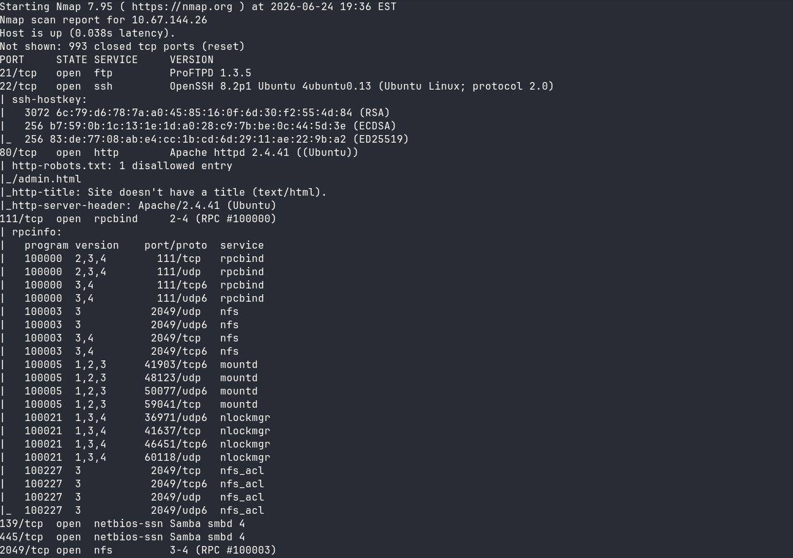
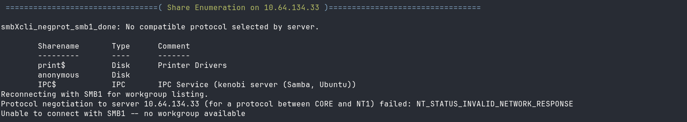
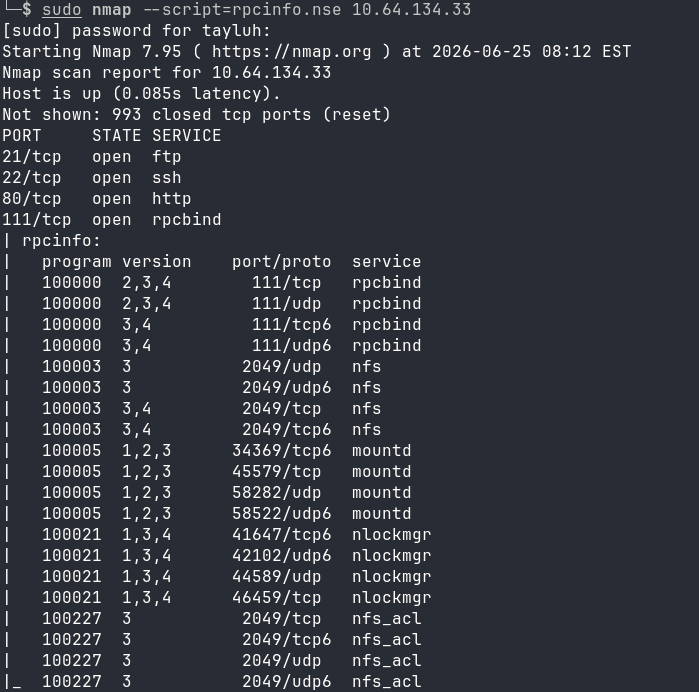
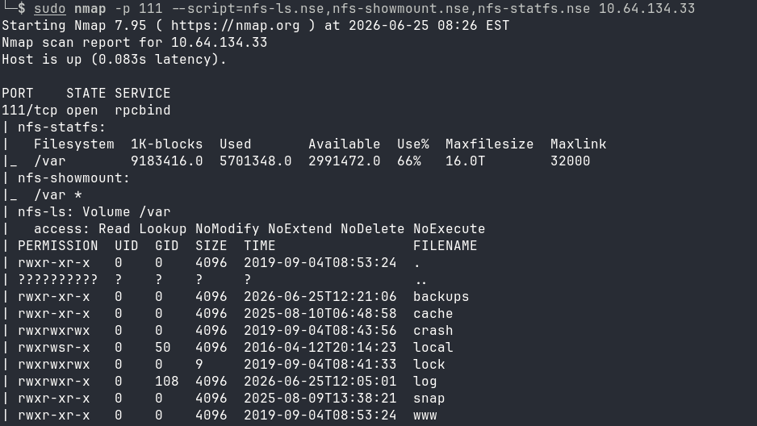
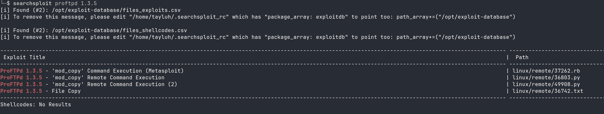
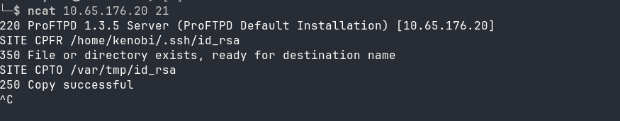
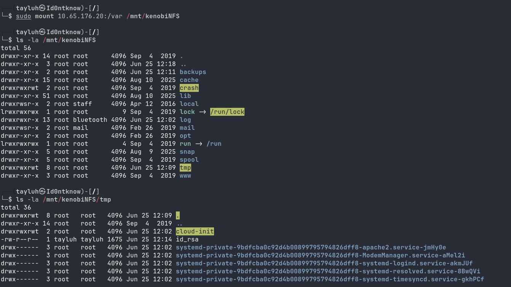
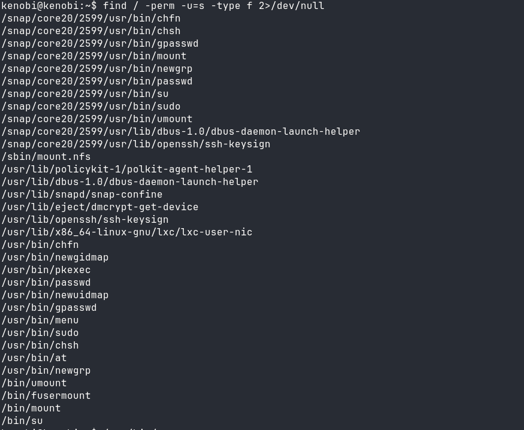
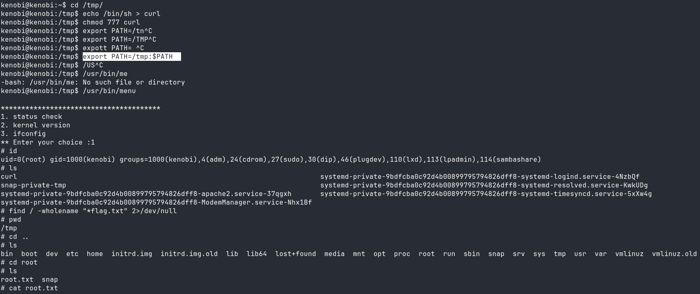

# Kenobi

"This room will cover accessing a Samba share, manipulating a vulnerable version of proftpd to gain initial access and escalate your privileges to root via an SUID binary."

Now a little research since I dont know what Samba is: It seems like Samba is the Linux version of the SMB protocol, it allows Linux systems to use the same protocol that Windows systems use. "Samba is a free software implmentation of the SMB networking protocol" ([Wikipedia](https://en.wikipedia.org/wiki/Samba_(software))). "Samba uses the Server Message Block (SMB) protocol, which is used by Windows systems to communicate with each other." ([redhat](https://www.redhat.com/en/blog/windows-linux-interoperability)) 

I will start the enumeration process using "nmap -sCV <ip addr>". The flags "-sCV" does a port scan with default scripts and checking for version number. 
My output was :

Now this produces a LOT of information but in reality, there's only 8 ports that are open. The two that we're interested in however, are going to be ports 139 and 445. This is because these ports are for network sharing of files. (and of course the room making us interested in it).

Going back to the THM walkthrough, it says:  "Nmap has the ability to run to automate a wide variety of networking tasks. There is a script to enumerate shares!"

nmap -p 445 --script=smb-enum-shares.nse,smb-enum-users.nse \<ip>

This is a little new to me. I knew about some of the scripts nmap could use but did not think about this. You can look at the availble scripts by going to the scripts directory (for me its '/usr/share/scripts') to look at all the available scripts. 

Now lets run the command they provided us.

\*side-note: I went down a whole rabbit hole of having to install enum4linux because the scripts used in the provided command didn't enumerate anything for me (even on the AttackBox). If that doesn't happen for you then awesome possum\*

So after using enum4linux -U -S \<ip>, I was able to get three listed shares:

We can now connect to the shares using smbclient //\<ip\>/anonymous  
After connecting to the share, you can use a simple 'ls' to list what is in it. In our case it's going to be log.txt. The room then wants us to download it using smbget -R smb://\<ip>/anonymous  
\*note: you do have to disconnect from the share before running this command*

Then simply read the file. There's information within the file about an rsa key being generated for the user Kenobi, and information about the ProFTPD server, such as the port it's using, what user/group it's set up under, and the fact that it used the default installation. 
The room then has us think back to our initial nmap scan and how there was a service on port 111 named rpcbind. 

"rpcbind is used by RPC (Remote Procedure Call) services. An RPC service is a server-based service that fulfills remote procedure calls. rpcbind is used to determine which services can respond to incoming requests to perform the specified service." ([Hackviser](https://hackviser.com/tactics/pentesting/services/rpcbind))

Essentially rpcbind is a directory service that tells a client what rpc services they can connect to. This is great for us because rpcbind will tell us about more services running on our target machine. Now the THM room tells us that there is a NFS (Network File System) that we are targeting and to use an nmap script to further enumerate that specific service. But, I decided to take that information as a hint and looked for a script to enumerate rpc services myself. I found rpcinfo.nse while looking through nmap's scripts, ran it and got this: 

 

 \*I realized that the initial nmap scan I had run also enumerated these services*

 We can see that there is a NFS service running. Since we now know this (Even though the room told us already) let's run another nmap script targeted at enumerating NFS. 
 
 In my terminal, I used ls /usr/share/nmap/scripts | grep nfs to look at what scripts are NFS specific, then used the output for my nmap scan: nmap -p 2049 --script=nfs-ls.nse,nfs-showmount.nse,nfs-statfs.nse \<ip>. My mistake was using the port 2049 and not the actual rpcbind port, so I ran the command again with the correct port of 111. and we get the output of:

 

 I then tried to see about how to connect to a NFS but, you'd have to install more utilities so I went back to the room to see what direction it was going in. The room says to pivot into the FTP service so we shall do just that.  
 The machine uses the ProFtpd server for the FTP service. We can take the version number from the initial nmap scan and do some research into some possible vulnerabilities that we can exploit to gain a foothold.

 Inputting the service and version number into searchsploit gives us four options to choose from:

 

I personally like to do a little more research into the exploit before using anything and what I got was: "The mod_copy module in ProFTPD 1.3.5 allows remote attackers to read and write to arbitrary files via the site cpfr and site cpto commands." ([NIST](https://nvd.nist.gov/vuln/detail/CVE-2015-3306)).  
This means all we have to do is connect to the ftp server and input these commands to be able to copy files/directories. Since anonymous login is enabled on the ftp server, this makes it easy to do so!
Well, I had thought that you needed to login as the anonymous user, but after more research, I found: "Any unauthenticated client can leverage these commands to copy files from any
part of the filesystem to a chosen destination. The copy commands are executed with
the rights of the ProFTPD service, which by default runs under the privileges of the
'nobody' user." ([Rapid7](https://www.rapid7.com/db/modules/exploit/unix/ftp/proftpd_modcopy_exec/))

Using ncat, we'll connect to the target on port 21. Then issue the command SITE CPFR(copy from) to copy the ssh key we had found from log.txt. After that we'll use SITE CPTO(copy to) to copy the key from the user's directory to the directory we could see from the NFS mount (/var):

  

We've now moved the rsa key on the target machine but we dont have it on our own. So we'll go ahead and mount the NFS using the mount command and confirm that the mod_copy exploit had worked  
\*I had to install the nfs client using sudo apt install nfs-common\*  

Now we can use Kenobi's rsa key to login to the machine. Make sure to chmod 600 the rsa key to use it (I didn't do it at first). Now we're logged in as the user Kenobi and we can read the required flag!  
Using whoami, we see that we have the privileges of kenobi only, no root.  
The room goes into checking for SUID bits on files using the find command. the specific command to achieve this would be  
find / -perm -u=s -type f 2>/dev/null. Now we need to look through the results to see what stands out to us in order for us to escalate our privileges:

I ran through a couple of these before I was finally able to answer the question for the THM room. The binary that is unusual is /usr/bin/menu.  
After that, I had to read into the room a bit more to know what to do. We need to use strings in order to be able to find human-readable strings within the binary we found, and within that binary, we can see that it uses the curl command. We can create a root shell by copying /bin/sh into curl so that whenever the binary 'menu' is ran it spawns a shell with root privileges :\)  

Then we need to set rwx permissions for the new curl binary. After that we set the path of the command to tmp by using export PATH=/tmp:\$PATH.  
I had to do some digging on this command before I fully understood it but, this is what I had gotten from it: The command puts /tmp before the PATH variable- This variable being what the shell searches through to find a command.

We edit the curl path so that when we run the /usr/bin/menu binary, it will see the /tmp path first which is where our malicious binary resides!

### Final thoughts:
I really enjoyed creating this walkthrough. Although some things used in the TryHackMe room didn't work on my personal machine (and sometimes the AttackBox) I enjoyed adapting to the situation. This machine is vulnerable due to multiple factors:  

+ Out of date FTP server
+ /var/tmp being mountable by anyone
+ the /bin/menu binary not using an absolute path
+ Anonymous FTP login

_This write-up was written with the HELP of AI_