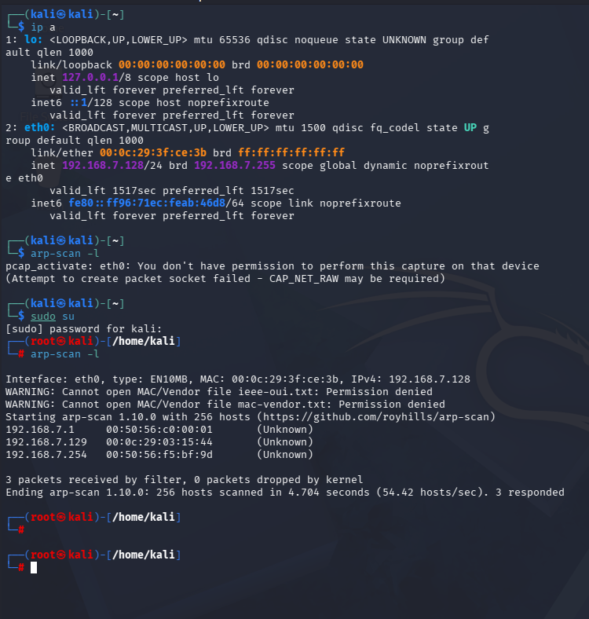
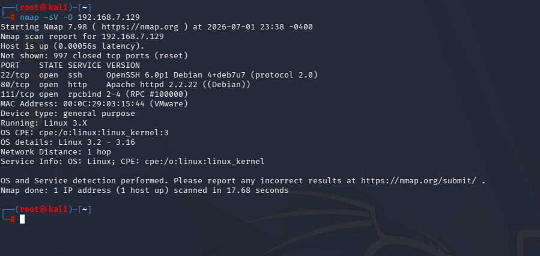
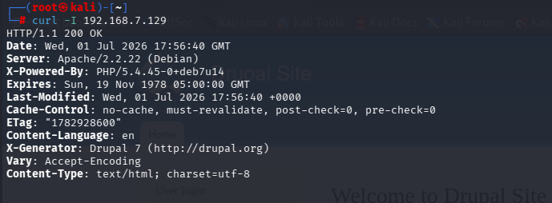
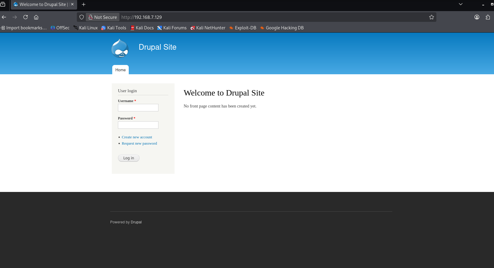
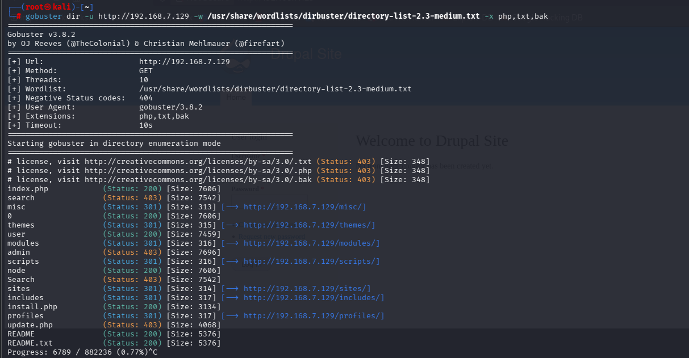
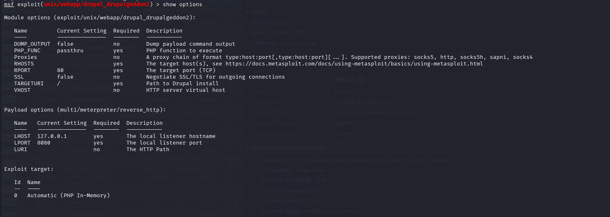
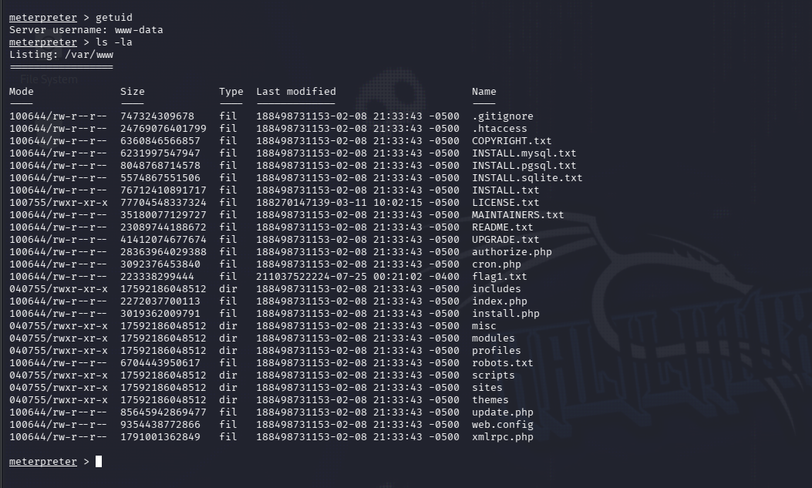
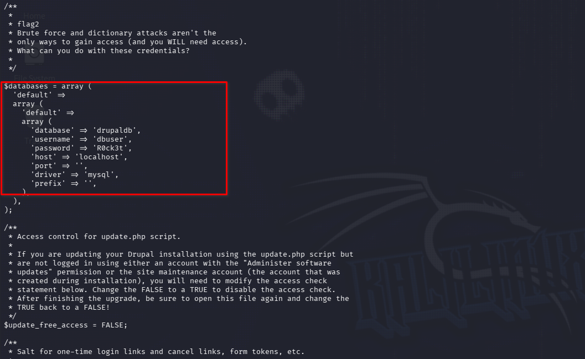
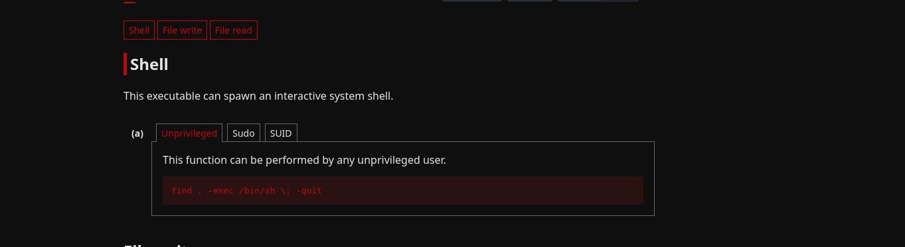
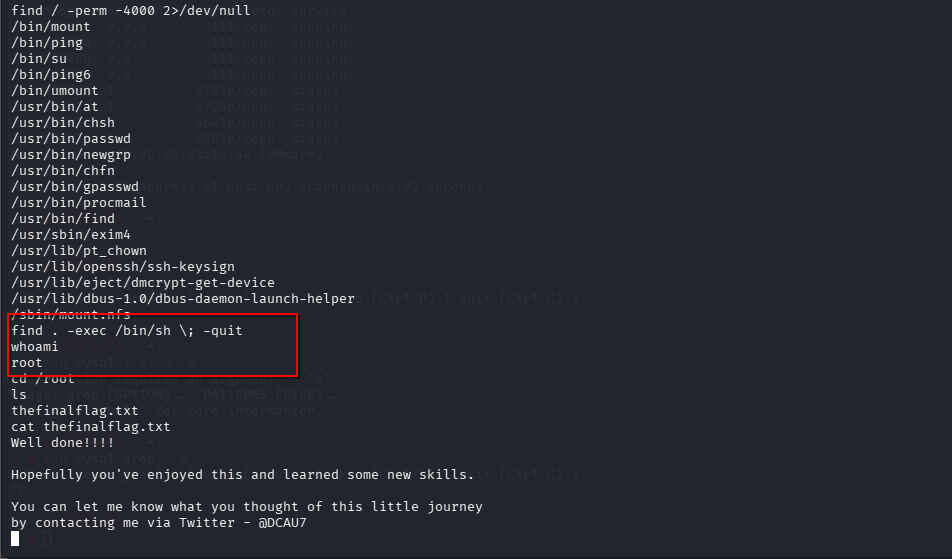

# DC-1
"DC-1 is a purposely built vulnerable lab for the purpose of gaining experience in the world of penetration testing." 

This walkthrough will be for the DC-1 vulnerable machine from VulnHub. Some pre-requisites include basic linux familiarity and the willpower to do a google search. I will be using VMWare to run this machine and a Kali Linux machine, which will both be on a host-only network because I really don't want the vulnerable machine touching the great Internet. 

The goal of this machine is to read the flag located in the root directory. According to the machine, I won't even need root to read the flag but will need root-privileges.  
My goal of this room is to do deep reconnaissance on the machine to understand exactly which entry-point would be the best.

Let's get to it

After starting up my VMs, I first ran **ip a** in my Kali machine to see what my own IP address was, then ran **arp-scan -l**. The ARP scan is to see which devices are on my network by sending out ARP broadcasts on the network which then tells my device who is who.

As we can see, there are only three devices on this virtual network (Not including my Kali machine). Next, we'll go ahead and run an nmap scan on one of the listed devices. I'm going to target 192.168.7.129 because it is the address directly next to mine.  
I'm going to run **nmap -sV -O 192.168.7.129** so that I can get the versions of each service discovered and have nmap try to determine the operating system.

Now we're cookin'. As you can see in the screenshot we have a reported 3 ports open with one of them being rpcbind (a service that is a directory for other RPC services that we may be able to connect to). Nmap is also able to tell us the operating system with no issues.  
Now it's time to do some digging on the listed services and the operating system. I'm first going to look into the website on port 80. Using **curl -I 192.168.7.129** we can pull up the headers for the website and learn a bit more about the http server:

This gives us a great deal of information, we can see that the server is running Apache, PHP, and Drupal. I know what Apache and PHP are, but Drupal is a new name for me.
Drupal is a free, open-source CMS known for its addition of modules early on. Currently, Drupal 7 is becoming EOL and the target machine is running it.
Navigating to the actual page, we see a default login page:  

After looking through the source code nothing really stands out to me besides a couple directories that, after navigating to them, give 403 Forbiddens. Although I was doing some digging manually, I had gobuster running while doing that:

After going through some of those I decided that I need to actually do what I said I was going to do originally: Dig into the services. I kind of got side tracked trying to enumerate the website but let's actually look into the Apache, PHP, and Drupal versions and see if any CVEs will pop up.
All three of the services had vulnerabilities associated with them. The two biggest ones to me seem to be for PHP and Drupal. The vulnerability for Drupal can allow attackers to use RCE which is VERY big. "A remote code execution vulnerability exists within multiple subsystems of Drupal 7.x and 8.x. This potentially allows attackers to exploit multiple attack vectors on a Drupal site, which could result in the site being completely compromised." ([drupal](https://www.drupal.org/sa-core-2018-002))  
This exploits the HTTP POST method in order to execute commands on the target system. And what do ya know? There's a user register directory that we might be able to target.

I had gone down a couple of rabbit-holes trying to figure out exactly what to use to exploit this vulnerability. I had completely forgotten about searchsploit then used it to produce a good amount of results. Seeing how there were a couple of modules of Metasploit, we'll go ahead and start the msfconsole.
After starting we'll search for the exploits that Metasploit has for drupalgeddon2. One pops up with an excellent rank. After selecting that exploit, we'll go ahead and take a look at the options to set:

We'll go ahead and set **RHOST** to the target IP of **192.168.7.129** and hit exploit to see what happens. Annnnnd I got "Exploit completed but no session created" so now I have to do some debugging. I'm first going to verify that **RHOST** is set correctly to 192.168.7.129 and **LHOST** needs to be set to the Kali machine's IP not my actual device's. After setting **LHOST** to my Kali machine's IP I ran it again and got the same message, then I did some digging. I had set **VERBOSE** to true and **DUMP_OUTPUT** to true to see where it went wrong. After trying again I managed to gain a Meterpreter shell. Honestly don't know what happened, my only assumption is that Metasploit needed another go at the exploit.

Although we do have a foothold, we can't really do anything since we are the **www-data** user. We need to find a way to escalate our privileges in order to read the flag at root.  
For now, we'll go ahead and explore a little bit by reading what we can in the current directory (especially **flag1.txt**). Inside of the file, the flag reads: "Every good CMS needs a config file - and so do you." whatever that means. In actuality, we'll go ahead and check out the listed **.config** file, especially because config files can contain API keys, cleartext credentials, etc.  
At this point, I had used the wrong config file. After doing some research (Asking Claude for some indirect help), I had found out that the web.config file is a default file that is shipped with Drupal since it's built to be used on both Linux & Windows systems. Knowing that **/sites/default** can be an interesting directory is something that comes with time. However, after some thinking, I should've let myself explore some more before asking for some help. Especially considering the fact that the sites/ directory <u>does</u> sound like an interesting one. Oh well, Live and Learn. Now we have some MySQL creds so let's see about using them:

This was another time for some research. Trying to drop into a native shell instead of using the Meterpreter session to get MySQL started was not great. Since we already have an initial foothold we can see about privilege escalation using GTFOBins  
_*I went down MULTIPLE rabbit holes trying to see how to go along with the VulnHub machine but eventually decided to shoot for priv esc._  
First, we need to find some SUID binaries using find: **find / -perm -4000 2>/dev/null**. This will find any binary, or executable, that runs with the permissions of root. Interestingly enough, the <u>find</u> command is listed after running the find command.  
So, we have the binary that we will use to get a new shell; the next thing is to reference GTFOBins and see what it says to use for said binary:

And by running that command we are now the root user!

I had a lot of fun with this target machine. Although I would have liked to create my own payload to establish a shell, I know that I'm not skilled enough to do that... <u>Yet</u>. Either way, Metasploit is another tool that can and should be used because, if it ain't broke, don't fix it.  
The main vulnerabilities that I had found were that the target was running an outdated version of Drupal and had stored credentials in plaintext inside of its configuration file that was readable by any user. Although I went straight to privilege escalation, these credentials could've been used and abused to further enumerate the database that could contain other users' credentials.

Other than that I can't wait to start the next one!