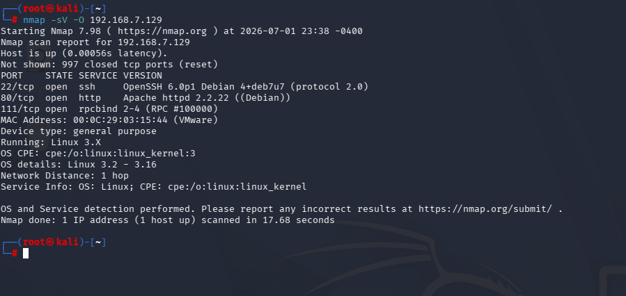
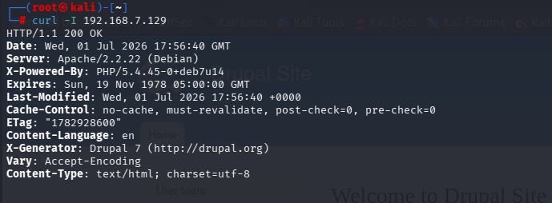
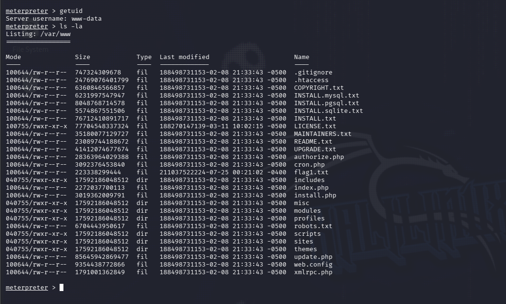
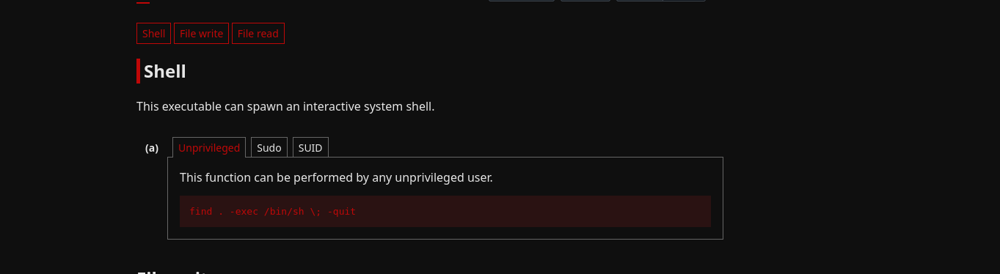
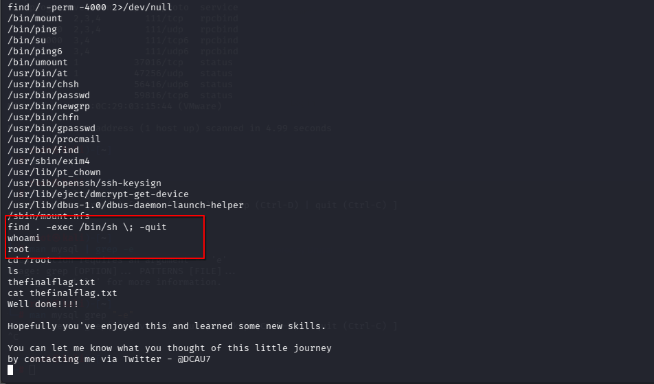

# [VulnHub] - [DC-1]

**Difficulty:** Easy
**Category:** Linux

## Summary
Vulnerable Linux CMS exploited by taking advantage of an outdated vesrion of Drupal.     

## Enumeration
**[MITRE technique: T1595]**  
Started by using 'nmap -p -sCV <ip address\>' to scan all ports and grab banners in one go.

I see that there's a web server on port 80 so we'll go ahead and grab the headers from said server using 'curl -I <ip address\>'

There's a couple of good pointers to look into from this but, I've never heard of Drupal so i'll look into that one. After a little bit of research, I found out that Drupal is a free, open-source CMS known for its addition of modules early on.  
I'll go ahead and take a look at the version of Drupal itself and see what pops up. There was the Drupalgeddon vulnerabilities that allow RCE (Remote Code Execution). We can possibly use MetaSploit to automate this process.
## Exploitation
**[MITRE technique: T1190]**  
Start MetaSploit using 'msfconsole'. Once loaded up, we can search for vulnerabilities by using the command 'search exploits drupal" then select the corresponding number for the Drupalgeddon exploit. After selection, we need to make sure that the target IP and any other required options are set. Use 'show options' in order to display them. Set the target IP by using 'set RHOST <ip address\>' and the 'exploit'.  
This might take more than one try, it did for me. After a couple seconds, you'll be dropped into a Meterpreter shell.  

## Privilege Escalation
**[MITRE Technique: T1548.001]**  
Using 'getuid' (Not 'whoami', Meterpreter doesn't support it) shows that your're just the **www-data** user. Using 'ls -la' does show us a good amount, especially the first flag. The first flag reads: "Every good CMS needs a good config file". I went down a little rabbit hole of trying to find a default config file and got frustrated so I went straight to finding a SUID binary. Using 'find / -perm 4000 2>/dev/null' one of the more interesting binaries used was actually the **find** command. Looking at GTFOBins, We can use the command found:

  
 
 and doing so gives us a shell as root user, enabling us to read the flag.

 

## Lessons Learned
This machine was vulnerable due to an outdated version of Drupal that had allowed abuse of the Forms API from Drupal. Although I had abused a SUID binary I wish I had used and pivoted from the credentials in the default config (I had found out about them after looking at some other walkthroughs.)